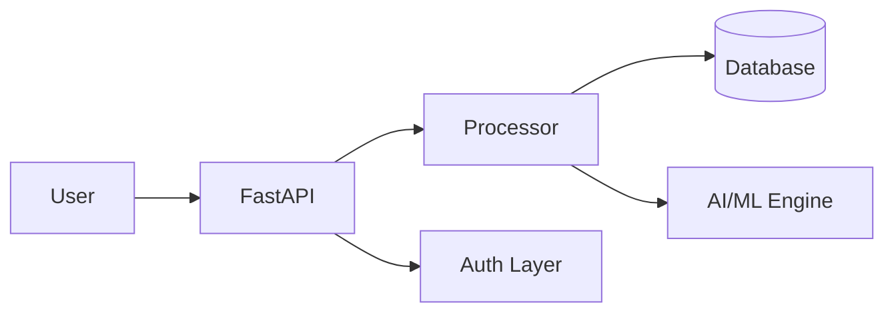

<div align="center">

# Insider Threat Detector

**Behavioral analytics for nation-state and negligent insider threat detection**

[](https://python.org)
[](LICENSE)
[](SECURITY.md)

[](https://github.com/Raphasha27/kirov-dynamics)

**Built by [Koketso Raphasha](https://github.com/Raphasha27) — Practical AI for Africa**

</div>

## Overview

Advanced insider threat detection simulator that models nation-state actors, malicious insiders, and negligent employees. Uses behavioral analytics, risk scoring, and scenario-based simulation for security team training.

## Features

- **Nation-State Scenarios** — Advanced persistent threat simulation
- **Negligent Insider Models** — Accidental data exposure scenarios
- **Behavioral Analytics** — User and entity behavior analysis (UEBA)
- **Risk Scoring** — Weighted multi-factor risk assessment
- **Alert Generation** — Real-time alerting with playbook recommendations
- **Reporting Dashboard** — Executive summaries and detailed logs


## Architecture



Microservices-based architecture with API Gateway, authentication layer, PostgreSQL persistence, and event-driven communication.

## Quick Start

```bash
git clone https://github.com/Raphasha27/Insider-Threat-Detector.git
cd Insider-Threat-Detector
pip install -r requirements.txt
python detect.py
```

## Ecosystem

| Project | Description |
|---------|-------------|
| [DDOS-Detection-Simulator](https://github.com/Raphasha27/DDOS-Detection-Simulator) | Traffic analysis and DDoS alert generation |
| [Phishing-Awareness-Game](https://github.com/Raphasha27/Phishing-Awareness-Game) | Educational security awareness training |
| [Network-Port-Scanner](https://github.com/Raphasha27/Network-Port-Scanner) | Multi-threaded network scanning and banner grabbing |

## Product Ladder

```
GitHub (this repo)
    ↓
Portfolio → https://raphasha27.github.io/raphasha-dev-portfolio
    ↓
Contact → https://github.com/Raphasha27
```

## License

MIT — see [LICENSE](LICENSE)
